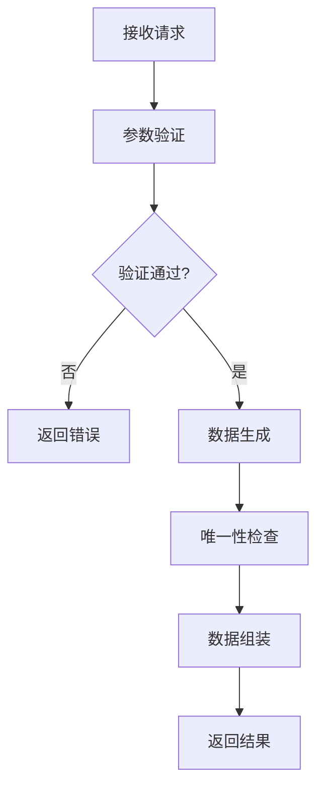

# 随机数据表格生成 API 算法实现文档

## 1. 算法概述

本文档详细描述了随机数据表格生成API的核心算法实现，包括数据生成策略、唯一性保证机制、错误处理逻辑等关键技术细节。

---

## 2. 核心算法架构

### 2.1. 整体流程



### 2.2. 算法模块

1. **参数验证模块** - 验证请求参数格式和范围
2. **数据生成模块** - 生成各种类型的随机数据
3. **唯一性管理模块** - 保证字段唯一性约束
4. **数据组装模块** - 组装最终返回结果

---

## 3. 参数验证算法

### 3.1. 验证流程

```python
def validate_table_request(data):
    """表格生成API参数验证主函数"""
    # 注意：JSON格式验证在 app.py 中使用 request.is_json 处理
    
    # 1. 必要参数检查
    if not _check_required_params(data):
        return False, "缺少必要参数"
    
    # 2. rows参数验证
    if not _validate_rows(data.get('rows')):
        return False, "数据量错误，rows参数应在1-32之间"
    
    return True, ""
```

### 3.2. 具体验证规则

#### 3.2.1. JSON格式验证
```python
# 在 app.py 中使用 Flask 内置方法
if request.is_json and request.json is not None:
    # 请求是有效的JSON格式
    data = request.json
else:
    # 请求不是JSON格式或JSON解析失败
    return jsonify({"error": "请求格式错误，请使用JSON格式"}), 400
```

**说明**：
- 使用 Flask 的 `request.is_json` 属性判断请求是否为 JSON 格式
- 使用 `request.json is not None` 确保 JSON 解析成功
- 避免重复造轮子，利用 Flask 框架的内置功能

#### 3.2.2. 必要参数检查
```python
def _check_required_params(data):
    """检查必要参数是否存在（内部函数）"""
    return (
        isinstance(data, dict) and
        'rows' in data
    )
```

#### 3.2.3. rows参数验证
```python
def _validate_rows(rows):
    """验证rows参数（内部函数）"""
    return (
        isinstance(rows, int) and 
        1 <= rows <= MAX_ROWS
    )
```

---

## 4. 数据生成算法

### 4.1. 基于 Faker 的函数式数据生成架构

```python
from faker import Faker
import random

# 全局 Faker 实例
fake = Faker('zh_CN')

# 全局唯一性跟踪器
phone_tracker = set()

def generate_id(row_index):
    """生成自增ID"""
    return row_index + 1

def generate_name():
    """生成随机中文姓名"""
    return fake.name()

def generate_phone():
    """生成唯一手机号"""
    max_attempts = 1000
    
    for _ in range(max_attempts):
        phone = fake.phone_number()
        # 清理格式，只保留数字
        phone = ''.join(filter(str.isdigit, phone))
        
        if phone not in phone_tracker:
            phone_tracker.add(phone)
            return phone
    
    # 如果无法生成唯一手机号，返回空字符串
    return ""

def generate_row(row_index):
    """生成单行数据（固定三个字段：id, name, phone）"""
    return {
        'id': generate_id(row_index),
        'name': generate_name(),
        'phone': generate_phone()
    }
```

### 4.2. 函数式设计优势

#### 4.2.1. 简洁性
- **无类实例化**：直接调用函数，无需创建对象
- **代码更少**：减少了类的样板代码
- **逻辑清晰**：每个函数职责单一

#### 4.2.2. 性能优势
- **内存效率**：没有类的实例化开销
- **执行速度**：函数调用比方法调用更快
- **资源节约**：全局变量复用，减少重复创建

#### 4.2.3. 维护性
- **易于测试**：纯函数更容易进行单元测试
- **易于调试**：函数调用栈更清晰
- **易于扩展**：需要时可以轻松添加新函数


---

## 5. 唯一性管理算法

### 5.1. 简化的唯一性约束实现

```python
# 全局唯一性跟踪器
phone_tracker = set()

def is_phone_unique(phone):
    """检查手机号是否唯一"""
    return phone not in phone_tracker

def add_phone_to_tracker(phone):
    """添加手机号到跟踪器"""
    phone_tracker.add(phone)

def generate_unique_phone():
    """生成唯一手机号"""
    max_attempts = 1000
    
    for _ in range(max_attempts):
        phone = fake.phone_number()
        # 清理格式，只保留数字
        phone = ''.join(filter(str.isdigit, phone))
        
        if is_phone_unique(phone):
            add_phone_to_tracker(phone)
            return phone
    
    # 如果无法生成唯一手机号，返回空字符串
    return ""
```

### 5.2. 冲突解决策略

1. **重试机制**：最多尝试1000次生成唯一值
2. **降级策略**：无法生成唯一值时返回空字符串
3. **内存管理**：使用集合(set)数据结构提高查找效率

---

## 6. 数据组装算法

### 6.1. 简化的主生成函数

```python
def generate_table_data(rows):
    """基于 Faker 的表格数据生成主函数（固定三个字段）"""
    result = []
    
    for i in range(rows):
        # 生成单行数据（固定三个字段：id, name, phone）
        row_data = generate_row(i)
        result.append(row_data)
    
    return result
```

### 6.2. 数据格式化

```python
def format_response(data):
    """格式化响应数据"""
    return {
        "status": "success",
        "data": data,
        "count": len(data),
        "timestamp": datetime.now().isoformat()
    }
```

---

## 7. 性能优化策略

### 7.1. 算法复杂度分析

- **时间复杂度**：O(n)，其中n为行数（固定三个字段）
- **空间复杂度**：O(k)，其中k为唯一值数量
- **最坏情况**：唯一值生成失败时的重试机制
- **函数式优势**：无类实例化开销，执行效率更高

### 7.2. 优化措施

1. **预分配内存**：提前分配结果数组空间
2. **固定字段**：只生成三个固定字段，减少复杂度
3. **唯一性优化**：只跟踪手机号的唯一性
4. **函数式设计**：避免类的实例化开销
5. **全局变量复用**：Faker实例和跟踪器全局共享

---

## 8. 错误处理机制

### 8.1. 异常处理策略

```python
def safe_generate_table(rows):
    """安全的数据生成函数"""
    try:
        # 参数验证
        is_valid, error_msg = validate_table_request({"rows": rows})
        if not is_valid:
            return None, error_msg
        
        # 数据生成
        data = generate_table_data(rows)
        return data, None
        
    except Exception as e:
        return None, f"数据生成失败: {str(e)}"
```

### 8.2. 降级策略

1. **唯一性冲突**：返回空字符串而非报错
2. **内存不足**：分批生成数据
3. **超时处理**：设置最大生成时间限制

---

## 9. 测试策略

### 9.1. 单元测试

```python
def test_data_generation():
    """数据生成测试"""
    # 测试基本功能
    data = generate_table_data(5)
    assert len(data) == 5
    assert all("id" in row for row in data)
    assert all("name" in row for row in data)
    assert all("phone" in row for row in data)
    
    # 测试唯一性
    phones = [row["phone"] for row in data if row["phone"]]
    assert len(phones) == len(set(phones))

def test_individual_functions():
    """测试单个函数"""
    # 测试ID生成
    assert generate_id(0) == 1
    assert generate_id(4) == 5
    
    # 测试姓名生成
    name = generate_name()
    assert isinstance(name, str)
    assert len(name) > 0
    
    # 测试手机号生成
    phone = generate_phone()
    assert isinstance(phone, str)
    assert len(phone) > 0
```

### 9.2. 压力测试

- **大数据量测试**：测试32行数据的生成性能
- **唯一性测试**：验证大量数据下的唯一性保证
- **内存测试**：监控内存使用情况

---

## 10. 部署考虑

### 10.1. 环境配置

- **Python版本**：3.8+
- **依赖库**：faker, random, datetime, json
- **内存要求**：最小128MB，推荐256MB
- **Faker版本**：建议使用最新稳定版本
- **字段固定**：只生成id、name、phone三个字段

### 10.2. 监控指标

- **响应时间**：平均响应时间 < 100ms
- **成功率**：API调用成功率 > 99%
- **内存使用**：内存使用率 < 80%

---

## 11. 总结

本算法实现文档详细描述了基于 Faker 库的函数式随机数据表格生成API的核心技术实现，包括：

1. **参数验证**：简化的输入验证机制（只需验证rows参数）
2. **函数式数据生成**：基于 Faker 库的固定三字段函数式数据生成算法
3. **唯一性管理**：高效的手机号唯一性约束实现
4. **性能优化**：针对性的性能优化策略（函数式设计优势）
5. **错误处理**：完善的异常处理和降级机制

该算法设计兼顾了功能完整性、性能效率和系统稳定性，通过函数式编程和固定三个字段（id、name、phone）简化了API复杂度，使用 Faker 库生成真实、多样化的测试数据，满足数据库学习和测试的基本需求。

## 12. Faker 库优势

### 12.1. 数据质量提升
- **真实性**：生成的数据更接近真实世界的数据
- **多样性**：支持多种语言和地区的数据格式
- **一致性**：数据格式统一，便于测试

### 12.2. 开发效率提升
- **代码简化**：大幅减少自定义数据生成代码
- **维护性**：减少维护成本，专注于业务逻辑
- **API简化**：固定字段减少API复杂度
- **函数式设计**：避免类的复杂性，代码更直观

### 12.3. 测试覆盖度提升
- **边界测试**：Faker 能生成各种边界情况的数据
- **国际化测试**：支持多语言环境测试
- **数据完整性**：确保生成的数据符合业务规则
